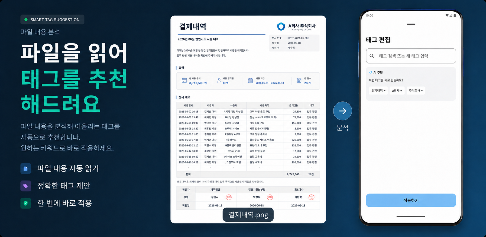
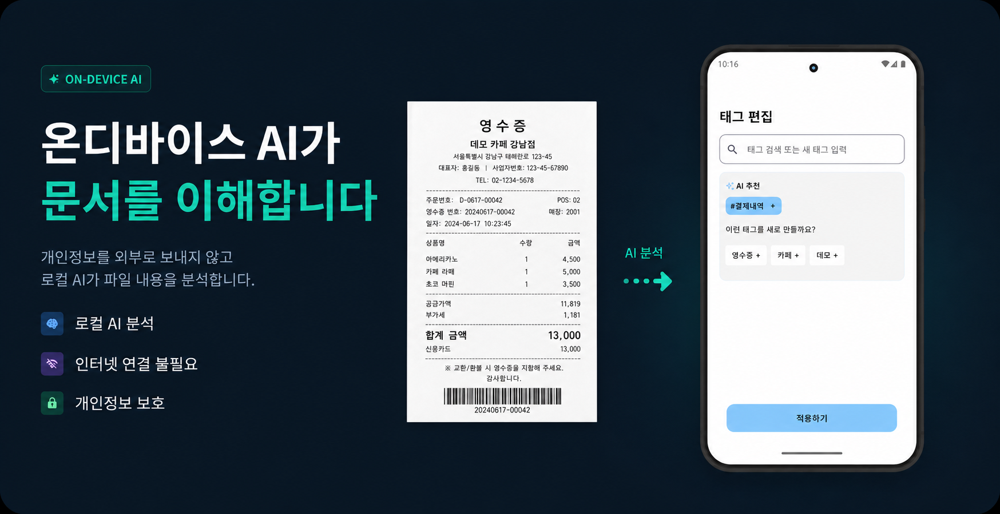
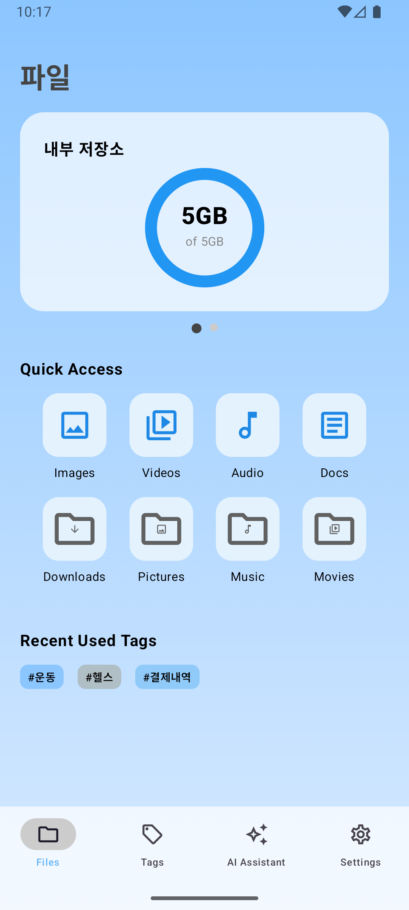
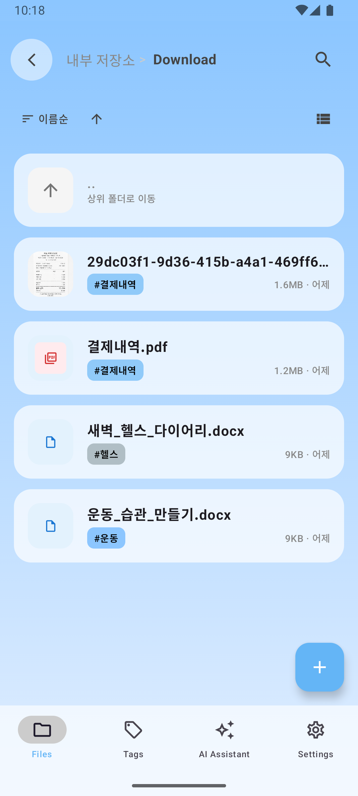
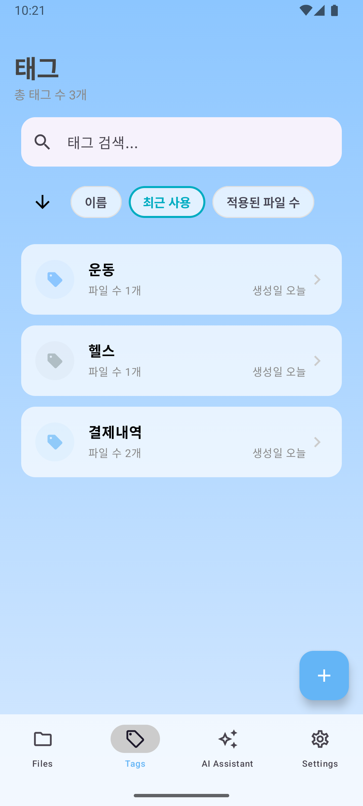
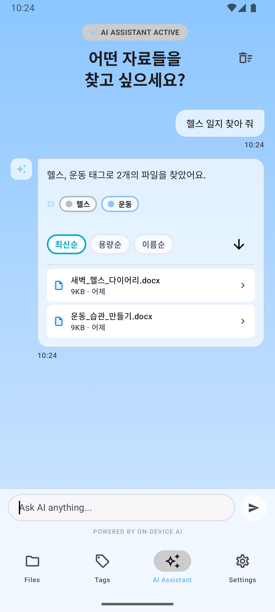
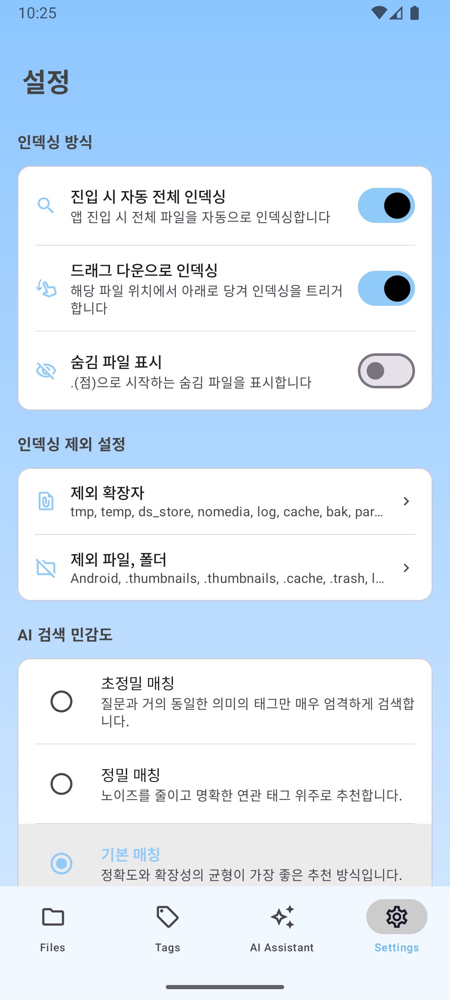

# Tag File

온디바이스 AI 기반 태그 중심 파일 관리자

기존 파일 관리자는 폴더 구조에 의존하기 때문에 사용자가 파일의 저장 위치를 기억해야 합니다.

Tag File은 파일에 태그를 부여하여 폴더 구조와 관계없이 파일을 관리할 수 있도록 설계된 Android 파일 관리자입니다.

또한 ONNX Runtime 기반 온디바이스 AI를 활용하여 파일에 적합한 태그를 추천하고, 의미 기반(Semantic Search) 검색 기능을 통해 유사한 태그 및 관련 파일을 탐색할 수 있습니다.

<p align="center">  </p>
<p align="center">  </p>

---
## 스크린샷

### 파일탭
<p align="center">   </p>

### 태그탭
<p align="center">  </p>

### 검색탭
<p align="center">  </p>

### 설정탭
<p align="center">  </p>

## 주요 기능

### AI 태그 추천

* ONNX Runtime 기반 온디바이스 AI 추론
* 파일에서 추출한 대표 텍스트와 저장된 태그 간 유사도 분석
* 서버 없이 동작하는 태그 추천 시스템

### 태그 기반 파일 관리

* 다중 태그 지원
* 폴더 구조에 의존하지 않는 파일 분류
* 태그를 활용한 빠른 파일 탐색

### 의미 기반 검색

* 벡터 임베딩 기반 검색
* 코사인 유사도 활용
* 단순 문자열 검색을 넘어 유사 의미 탐색 지원

### 대용량 파일 스캐닝

* DFS(Stack) 기반 파일 탐색
* MD5 해시 기반 파일 식별
* 파일 이동 및 이름 변경 후에도 태그 유지
* Semaphore 기반 디스크 I/O 최적화
* 300GB 이상 이미지·영상 데이터가 저장된 실기기 환경 검증
* 약 5분 내 전체 파일 인덱싱 완료

---

## 기술 스택

### Android

* Kotlin
* Jetpack Compose
* Navigation Compose
* Coroutines
* Flow
* Hilt

### Architecture

* Clean Architecture
* MVVM
* MVI State Management

### AI

* ONNX Runtime
* Embedding Model
* Cosine Similarity

서버 의존 없이 태그 추천 기능을 제공하기 위해
온디바이스 임베딩 모델 기반 AI 추론 구조를 적용했습니다.

### Storage

* Room
* File System API

---

## 아키텍처

```text
AIFolder
├── app          # UI 및 Android Framework 계층
├── data         # Repository 구현 및 데이터 처리
├── domain       # 비즈니스 로직 및 UseCase
├── local-source # Room DB 및 로컬 파일 접근
└── di-bridge    # 모듈 간 의존성 연결 및 DI 구성


Dependency Flow
app → domain
app → data
data → domain
data → local-source
di-bridge → 의존성 주입이 필요한 모듈에 의존성 주입
```

---

## 주요 기술적 도전 과제

### 1. 대용량 파일 환경 최적화

문제

* 수십만 개 파일 탐색 시 메모리 사용량 증가
* 디스크 I/O 병목 발생

해결

* DFS(Stack) 기반 파일 탐색
* Semaphore 기반 파일 해시 계산 제어
* 경량 작업과 디스크 읽기 작업 분리

결과

* 300GB 이상 실기기 환경에서 약 5분 내 전체 파일 스캔 완료

---

### 2. 파일 이동 시 태그 유지

문제

* 경로 기반 식별 시 파일 이동 후 태그 유실

해결

* MD5 해시 기반 파일 식별 시스템 구축

결과

* 파일 이동 및 이름 변경 이후에도 태그 유지 가능

---

## 향후 계획

* 멀티모달 AI 기반 이미지 분석
* 문맥 기반 파일 검색 기능 고도화
* LLM 기반 문맥 이해를 활용한 태그 추천 정확도 향상

---

## 프로젝트 기간

2026.03 ~ 2026.06

