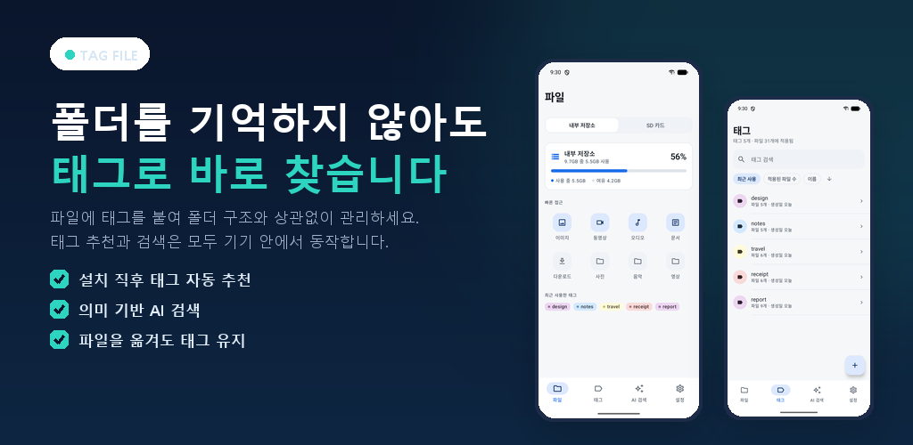
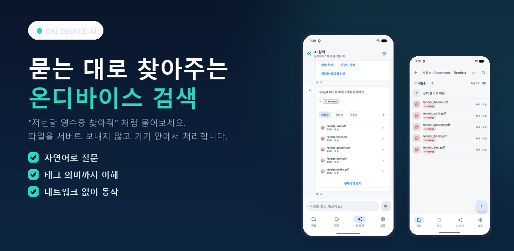
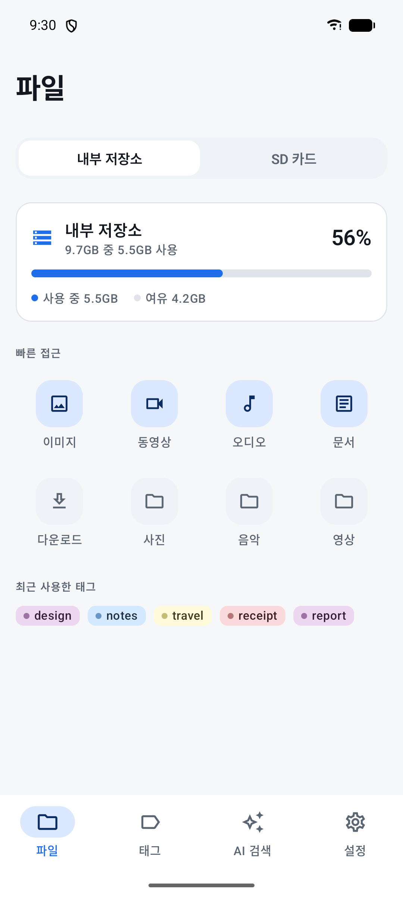
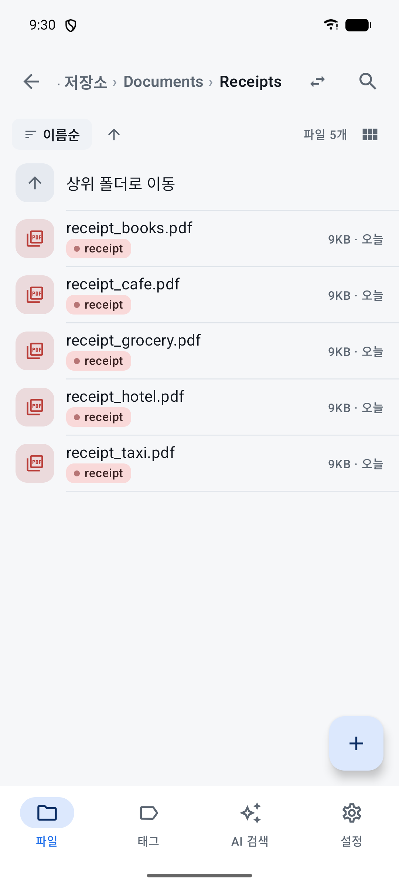
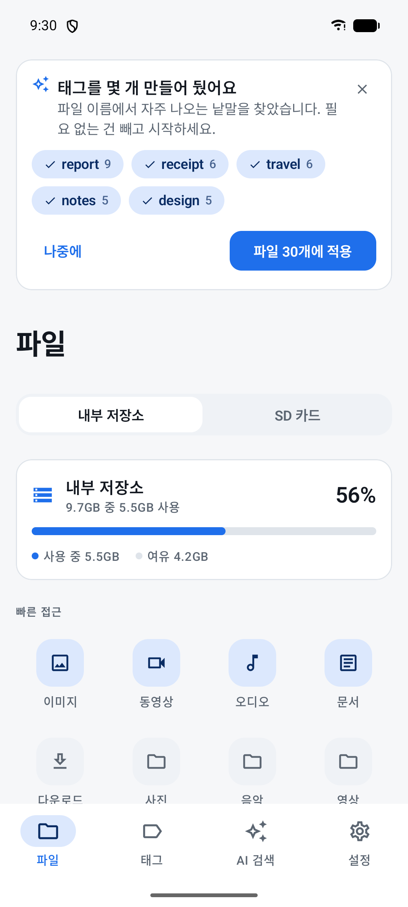
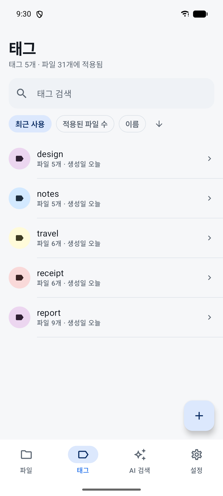
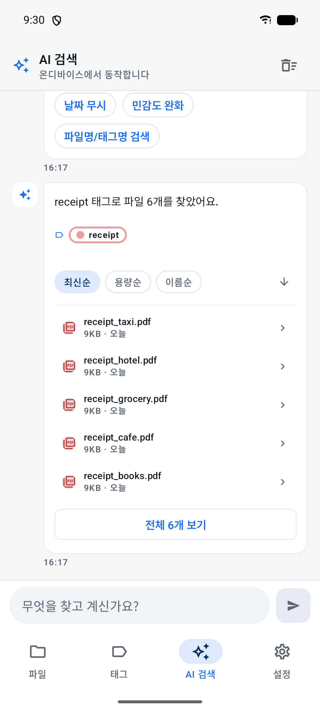
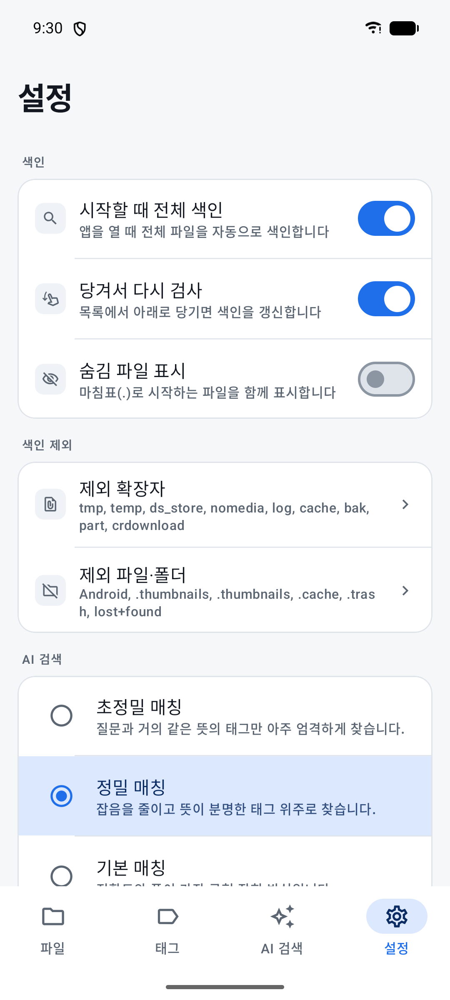

# Tag File

온디바이스 AI 기반 태그 중심 파일 관리자

기존 파일 관리자는 폴더 구조에 의존하기 때문에 사용자가 파일의 저장 위치를 기억해야 합니다.

Tag File은 파일에 태그를 부여하여 폴더 구조와 관계없이 파일을 관리할 수 있도록 설계된
Android 파일 관리자입니다. ONNX Runtime 기반 온디바이스 AI로 태그를 추천하고,
의미 기반 검색으로 유사한 태그와 관련 파일을 탐색합니다. 서버로 파일을 보내지 않습니다.

<p align="center">  </p>
<p align="center">  </p>

---

## 스크린샷

### 파일탭
<p align="center">   </p>

### 첫 실행 태그 추천
<p align="center">  </p>

### 태그탭
<p align="center">  </p>

### 검색탭
<p align="center">  </p>

### 설정탭
<p align="center">  </p>

---

## 주요 기능

### AI 태그 추천

* ONNX Runtime 기반 온디바이스 추론
* 파일에서 추출한 대표 텍스트와 저장된 태그 간 유사도 분석
* 서버 없이 동작

### 태그 기반 파일 관리

* 다중 태그 지원
* 폴더 구조에 의존하지 않는 분류
* 파일을 옮기거나 이름을 바꿔도 태그가 유지됨

### 의미 기반 검색

* 벡터 임베딩 + 코사인 유사도
* 문자열 일치를 넘어 의미가 비슷한 태그·파일 탐색

### 첫 실행 태그 추천

설치 직후에는 태그가 하나도 없어 앱의 핵심 기능을 써보기까지 여러 단계가 필요했습니다.
첫 스캔이 끝나면 파일 이름에서 반복되는 키워드를 뽑아 태그 후보를 제안합니다.
파일 이름만 보며, 무시해도 앱 동작에는 영향이 없습니다.

### 그 밖에

* 라이트 / 다크 / 시스템 테마
* 한국어 · 영어 (per-app locale 지원)

---

## 대용량 파일 스캐닝

수십만 개 파일이 있는 SD 카드를 대상으로, 계측 → 원인 규명 → 최적화 → 검증을 거쳐
다시 만들었습니다.

**측정 환경**: 디렉터리 2,884개 / 파일 144,909개, exFAT SD 카드, release 빌드

| 조건 | 개선 전 | 개선 후 |
|---|---|---|
| 첫 스캔 · 캐시 재가열됨 | 87.4s | **45.0s** |
| 첫 스캔 · 캐시 차가움 | 146.4s | **81.2s** |
| 재스캔 | 143s | **1.5s** |

### 1. 폴더 mtime 비교로 재스캔 건너뛰기

폴더의 mtime은 그 안에서 항목이 생기거나 사라질 때 갱신됩니다. 저장해둔 값과 같으면
직속 목록도 그대로이므로, 수십 ms짜리 `readdir` 대신 `stat` 한 번으로 넘어갑니다.
재스캔에서 99%의 폴더를 건너뜁니다.

파일 *내용*만 바뀐 경우는 폴더 mtime이 안 변해 지나치므로, 사용자가 직접 요청한
스캔(당겨서 새로고침)은 이 경로를 타지 않습니다.

### 2. 디렉터리 목록 미리읽기

기존에는 폴더 하나를 완전히 끝내고 다음으로 갔습니다. 그런데 목록 읽기는 SD 카드를,
DB 쓰기는 내부 저장소를 씁니다. **자원이 겹치지 않는데 순서 때문에 서로 기다리고
있었습니다.**

큐에 쌓인 다음 폴더들의 목록을 앞질러 읽습니다. 상태를 만지는 코드는 단일 스레드로
남기므로 동시성 위험이 거의 없습니다. 본체가 목록을 기다리는 시간이 전체의 8%까지
내려왔습니다.

### 3. 중복 연산 제거

같은 경로를 파일당 세 번 NFC 정규화하고 있었습니다. 파일 14만 개면 43만 번입니다.
한 번만 계산해 뒤 단계로 넘기고, 이미 읽은 파일 속성을 다시 `stat`으로 물어보던 곳과
호출마다 컴파일되던 정규식도 정리했습니다.

### 병렬도에 대해

`limitedParallelism` 값을 2 / 4 / 8 / 12로 바꿔가며 측정했지만 **총 시간에서
유의미한 차이가 없었습니다**(콜드 6회 기준 80.2\~83.0초). `readdir` 자체가 4스레드에서
약 1.4배로 포화하고 64까지 올려도 오르지 않기 때문입니다. 다만 4 미만으로 내리면
그 1.4배를 잃습니다.

즉 이 스캐너에서 이득을 만든 것은 병렬도 튜닝이 아니라 **불필요한 작업을 없애고
서로 다른 자원을 겹쳐 쓴 것**이었습니다.

### 측정 방법론

같은 코드로 재도 결과가 39초에서 177초까지 흔들려, 최적화보다 **믿을 수 있는 숫자를
얻는 데 시간이 더 걸렸습니다.** 교란 변수를 발견한 순서와 틀렸던 가설까지
[docs/scan-performance.md](docs/scan-performance.md)에 남겼습니다.

핵심은 `/proc/meminfo`의 `SReclaimable`(dentry/inode 캐시)입니다. 재부팅은 캐시를
확실히 비우지만, 그 뒤 **부팅 후 미디어 스캔이 SD 카드를 훑으며 캐시를 다시 채웁니다.**
이 값으로 조건을 사전 판정하자 회차 편차가 13초에서 1.5초로 줄었습니다.

---

## 기술 스택

### Android

* Kotlin
* Jetpack Compose
* Navigation Compose
* Coroutines / Flow
* Hilt
* Paging 3

### Architecture

* Clean Architecture
* MVI (Intent / State / 순수 Reducer / SideEffect)

상태 전이를 순수 함수로 분리해 안드로이드 없이 단위 테스트합니다.

```kotlin
fun handleIntent(intent: FilesIntent) {
    val before = _state.value
    _state.update { FilesReducer.reduce(it, intent) }
    runEffect(intent, before)
}
```

### AI

* ONNX Runtime
* Embedding Model
* Cosine Similarity

### Storage

* Room
* File System API

---

## 아키텍처

```text
├── app          # UI 및 Android Framework 계층
├── data         # Repository 구현 및 데이터 처리
├── domain       # 비즈니스 로직 및 UseCase (순수 JVM)
├── local-source # Room DB 및 로컬 파일 접근
└── di-bridge    # 모듈 간 의존성 연결


Dependency Flow
app  → domain
app  → data
data → domain
data → local-source
di-bridge → 의존성 주입이 필요한 모듈
```

`domain`과 `data`가 순수 JVM 모듈이라 계측·테스트가 안드로이드 의존 없이 돌아갑니다.
스캐너 프로파일링과 상태 리듀서 테스트가 모두 여기에 기댑니다.

---

## 주요 기술적 도전 과제

### 1. 대용량 파일 환경 최적화

**문제** — 수십만 개 파일 탐색 시 디스크 I/O 병목. SD 카드가 FUSE로 마운트돼 있어
`readdir` 한 번마다 커널 ↔ 유저공간 왕복이 발생합니다.

**해결** — 계측을 먼저 넣고 숫자를 보고 고쳤습니다. 폴더 mtime 비교, 목록 미리읽기,
중복 연산 제거. 자세한 내용은 위 [대용량 파일 스캐닝](#대용량-파일-스캐닝) 참고.

**결과** — 첫 스캔 45\~81초, 재스캔 1.5초.

### 2. 파일 이동 시 태그 유지

**문제** — 경로로 파일을 식별하면 이동 후 태그가 유실됩니다.

**해결** — Partial Hash 기반 식별. 파일 전체를 읽지 않아 디스크 비용이 낮습니다.

**결과** — 이동·이름 변경 후에도 태그 유지.

### 3. 상태 관리 재설계

**문제** — `FilesState`를 초기에 대충 잡고 기능이 늘 때마다 필드를 덧대다 보니 평면
필드가 41개까지 늘었습니다. 특히 다이얼로그가 `isRenameDialogVisible` + `renameTarget`
처럼 불리언과 데이터가 따로 놀아, "다이얼로그는 떠 있는데 대상이 null" 같은 상태가
표현 가능했습니다.

**해결** — 8개 그룹으로 재편하고, 다이얼로그는 데이터를 든 sealed interface로 묶어
불가능한 상태를 타입 수준에서 제거했습니다.

**결과** — `FilesViewModel` 1024줄 → 663줄, 리듀서 단위 테스트 22개.

---

## 테스트

단위 테스트 45개. 상태 전이와 스캔 판정 규칙을 안드로이드 없이 검증합니다.

| 대상 | 개수 |
|---|---|
| `FilesReducerTest` | 22 |
| `FileNameKeywordsTest` | 7 |
| `AddResourceUseCaseTest` | 6 |
| `ScanProfileTest` | 5 |
| `DirectorySkipRuleTest` | 5 |

`DirectorySkipRuleTest`는 실제로 낼 뻔한 사고 때문에 추가했습니다. mtime 스킵에서
저장된 값 대신 방금 읽은 값을 넘기면 자기 자신과 비교하게 되어 **모든 폴더를 영원히
건너뜁니다.** 스캔이 아무것도 갱신하지 않는데 겉으로는 정상으로 보여, 실기기 테스트로도
잡히지 않습니다.

---

## 향후 계획

* 멀티모달 AI 기반 이미지 분석
* 문맥 기반 파일 검색 고도화
* LLM 기반 태그 추천 정확도 향상

---

## 프로젝트 기간

2026.03 ~
